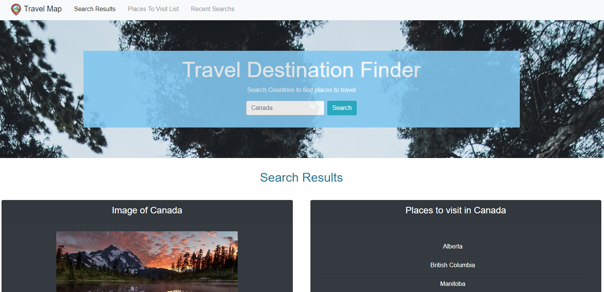
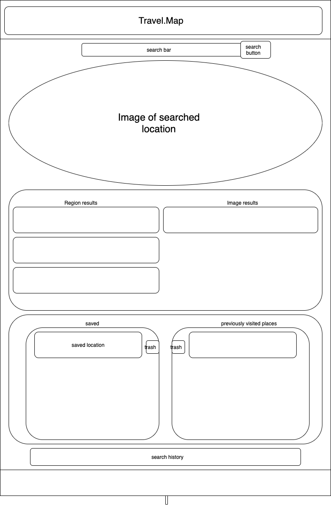
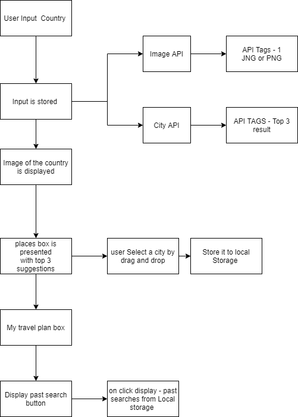

# weather-dashboard

## Purpose
* Travel.Map allows user to search by country to build a custom list of places to visit within that country. 

## Features includes 
* Locations to visits options based on country search
* Drag and drop locations to build a custom list
* Displays recent countries searched
* Creates a custom list of places to visit & visited
* Input is validated for serach and incase of API error, error msg are presented

## User Story
* Travel.Map provides user with a quick method to search places within any desired country to quickly build a travel list

## Acceptance criteria
* When user input a country in search bar and clicks search button
  * User is presented with list of locations to visit within that country
  * User can see an image representing the country
  * User can see a section with recent searches as country buttons
* User is able to drag and drop a location to containers in saved lists
* When user drag and drop a location to a bar labeled Remove
  * Dropped location is deleted
* When user clicks a country button in the ‘Recently Searched’ section
  * User is displayed with lists of locations to visit within that country again
  * Page is scrolled up to Search Results section
* User is able to repeat the process of adding places to their custom list. 

## Built With
* HTML
* CSS
* JavaScript
* jQuery
* Bootstrap
* AJAX
* JSON

## APIs 
* Geo DB
* Rest Countries
* Bing images

## Future Development
* Incorporating interactive world map which allows user to click on the map to search a country
* Integrate additional APIs to retrieve weather conditions and events/ activates for the chosen location 
* Add filter options to allow user to sort locations and events based on user interest and preferred activity type

## Screencapture of app screen

## Website
(https://khadra123.github.io/Travel.map/)

## By
Chaitali Patel, Nick Hoban & Khadra Mohamed
